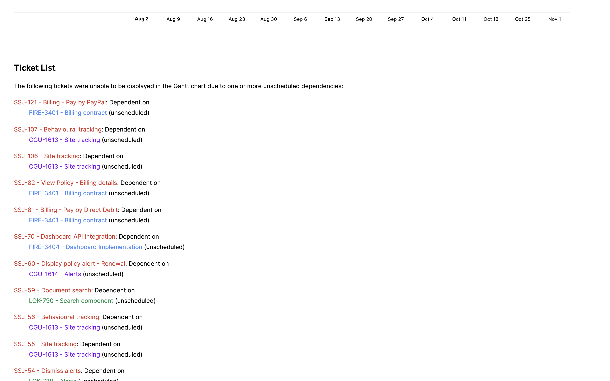
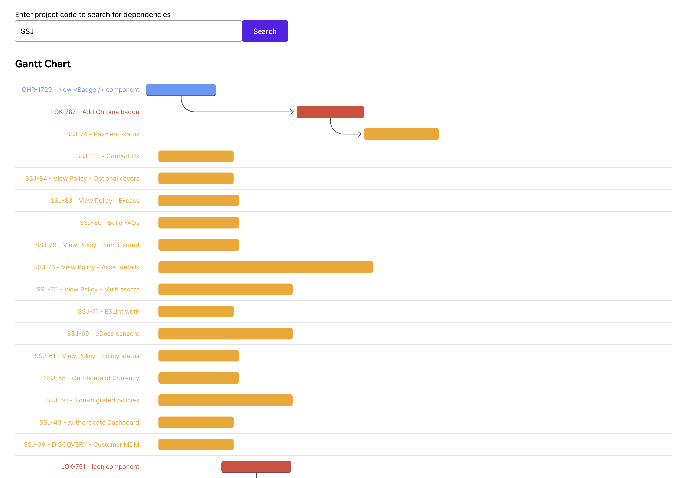
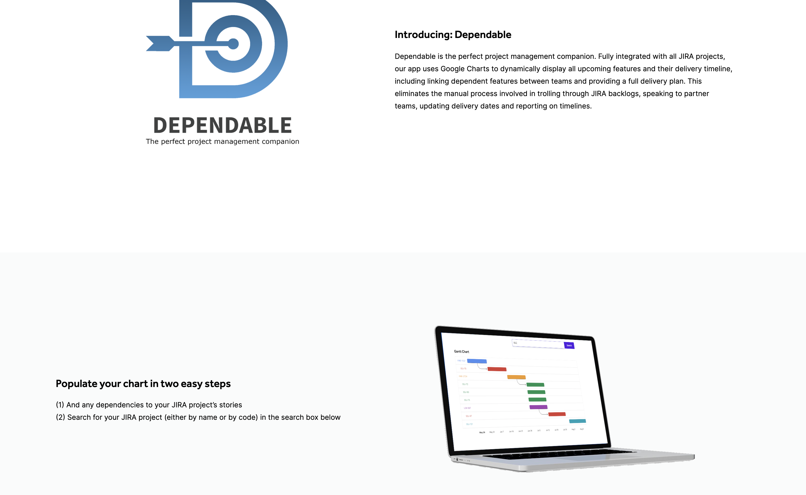
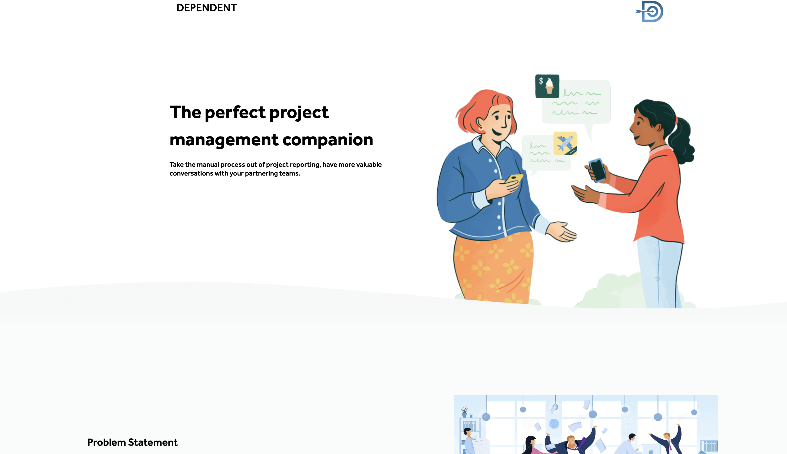

# dependable

Hackathon project to attempt to model inter-team dependencies transparently and beautifully

This project was bootstrapped with [Create React App](https://github.com/facebook/create-react-app).

## Screenshot

## Installation

git clone <projectName>

cd into ./BFF and run npm install

cd back to ./ and run npm install

## Usage

Open a separate terminal, change directory into ./BFF folder, run npm start for BFF

In the root project folder, run npm start for client

## UI explaination

### Gantt Chart

Displays tickets in graphical form and shows depended tickets with arrows. Plus a time line at the bottom of the chart.

### Ticket List

Shows a table of tickets and dependencies in text form with the dependency displayed below.

### Contributors

- **Thomas Burleigh**

- **Joseph Garner**

- **Jo Peyper**

- **Maysam Tayyeb**

- **Stanley Huang**
