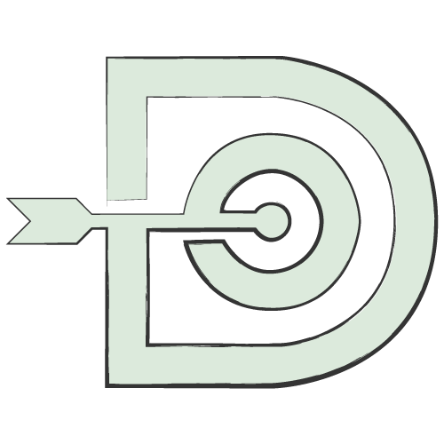
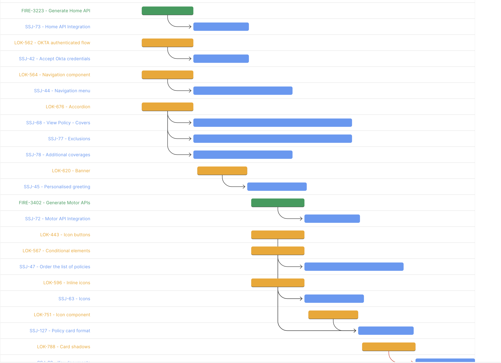
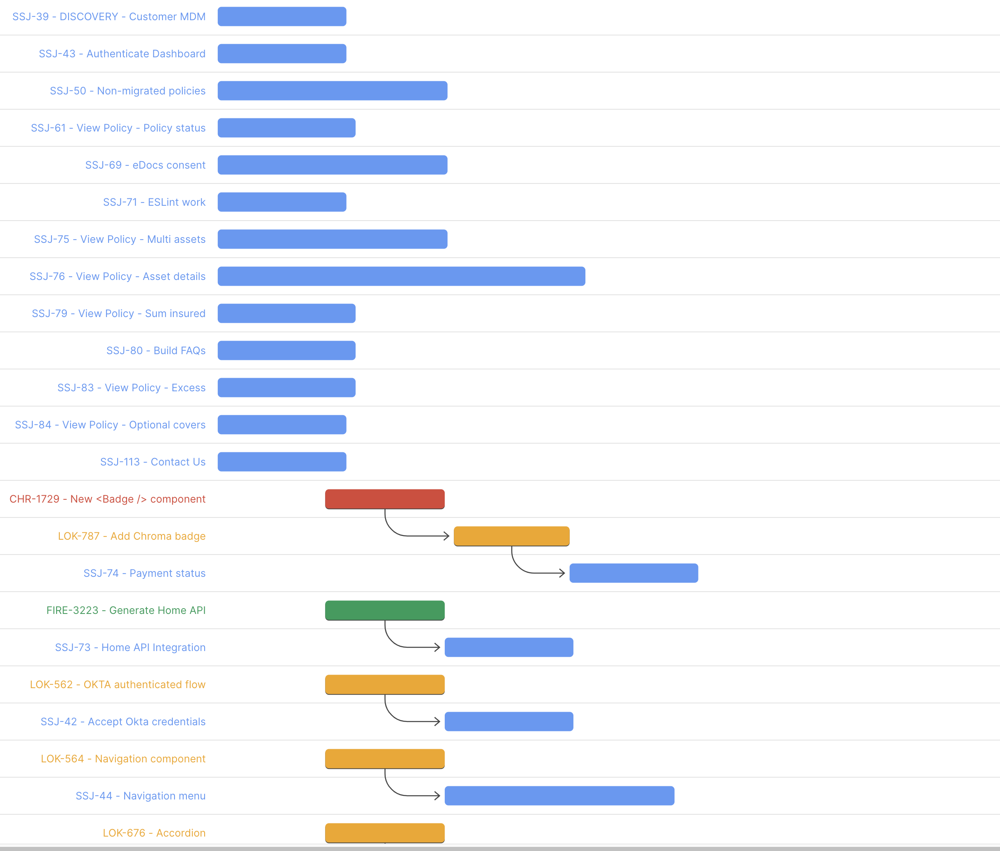

# Dependable

Hackathon project to attempt to model inter-team dependencies transparently and beautifully

This project was bootstrapped with [Create React App](https://github.com/facebook/create-react-app).

## Screenshot







## Installation

```
git clone <clone url>

cd bff
yarn

cd ..
yarn
```

Setup the BFFs .env file

```
echo "API_JIRA_HOST=https://jira-uat.auiag.corp
API_USERNAME=$(whoami)
API_SECRET=" > bff/.env
```

Then open `bff/.env` and input your password

If you want to use the production Jira, change the host to `https://jira.iag.com.au`

## Usage

Use two terminals to start the UI and BFF

```
cd bff
yarn start
```

```
yarn start
```

Your browser should open to http://localhost:3000

## UI explanation

### Project View

Enter your JIRA project id and search for your tickets, displayed in a graphical form and shows depended tickets with arrows. Plus a time line at the bottom of the chart.

### Unscheduled Features

Shows a table of tickets and dependencies there were unable to be incided in the project view to help start conversations.

### Contributors

- **Thomas Burleigh**
- **Joseph Garner**
- **Jo Peyper**
- **Maysam Tayyeb**
- **Stanley Huang**
